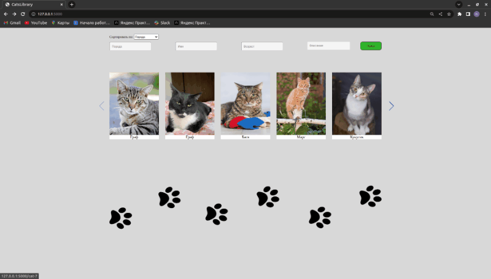

# APICatLibrary
# Задание на стажировку в СберБанк
    Спроектировать API для онлайн-магазина породистых котят, 
    используя Flask, sqlalchemy + PostgreSQL и docker.

    Создайте простой портал для электронной библиотеки. 
    Главная страница должна содержать список котят с пагинацией 5 котов. 
    Также должен присутствовать полнотекстовый поиск по следующим полям: 
    порода, имя, возраст и описание. 
    Должна присутствовать возможность сортировки результата: по породе, возрасту и релевантности (сортировка по умолчанию).

    При нажатии на кота должна открываться персональная страница этого котика. 
    На персональной странице кота должна присутствовать следующая информация: фотография кота, его имя, порода, пол, краткое описание и возраст в месяцах.

    Решение оформите в виде проекта на Flask в обвязке Docker контейнера. 
    Запуск решения должен происходить по команде "docker-compose up". В магазине должно быть как минимум 20 котиков для проверки реализации.

    Визуально проект не должен выглядеть отталкивающе. 
    Мы любим котиков :-)

# Запуск
    1. git clone https://github.com/Alset-Nikolas/APICatLibrary.git
    2. cd APICatLibrary
    2. docker-compose build
    3. docker-compose up 
    4. google -> http://127.0.0.1:5000/

# Иллюстрация работы:

# Пояснение к структуре
    application (Папка с проектом)
        |---> dataclass (dataclass обьекты )
        |         |-> cat.py 
        |        
        |---> forms (Основная форма поиска и сортировки)
        |         |-> cat_form.py 
        |        
        |---> models (Взаимодействие с postgreSQL)
        |         |-> __init__.py (создание и описание моделей)
        |         |-> breed.py (запросы к бд про породу кота)
        |         |-> cat.py (запросы к бд  про котов)
        |
        |---> static (Статические файлы)
        |         |-> img (Картинки)
        |         |-> scripts (JS)
        |         |-> style (CSS)
        |
        |
        |--> templates (Шаблоны)
        |         |-> base.html (Основа)
        |         |-> main.html (Страничка для роута /)
        |         |-> cat_info.html (Страничка для отдельного кота /)
        |
        |--> db.py (Инициализация и заполнение котами бд)
        |--> log.py (Логирование проекта)
        |--> main.py (Основной файл запуска)
        |--> requirements.txt (Файл с зависимостями)
        |--> settings.txt (Файл с котами)        
        README.md (сейчас тут)

# Логика поиска
    1. Если поле пустое - значит пользователю не важно какое оно должно быть
    2. Если просто нажать на поиск - будут все котята
